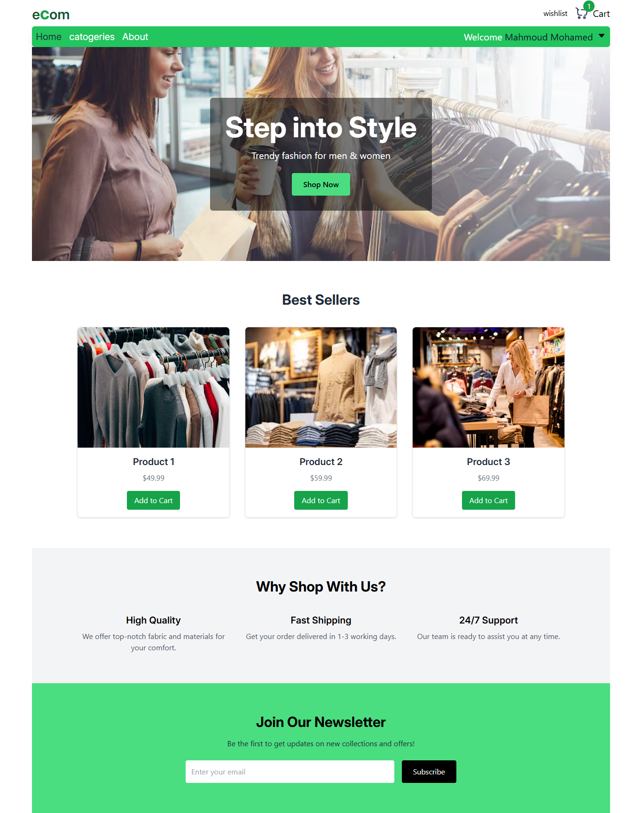
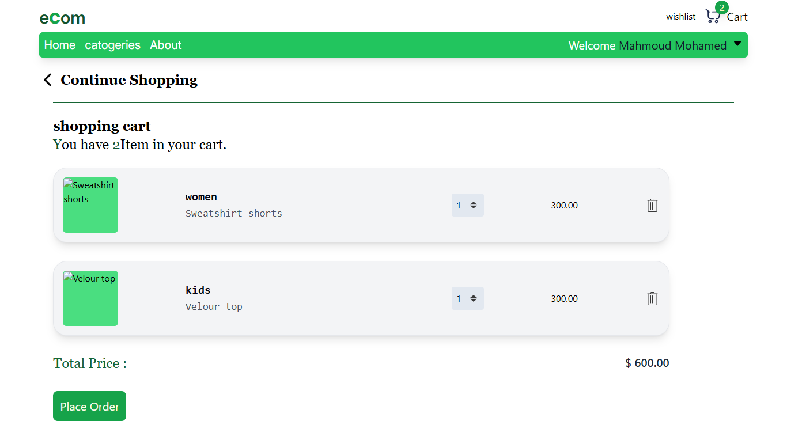
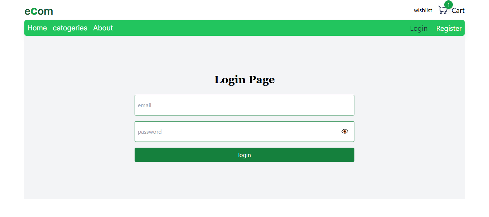

# 🛒 E-Commerce Website

A simple E-commerce project using **React** for the frontend and **JSON Server + JSON Server Auth** as a mock backend, with user authentication, state management, data validation, animations, and enhanced user experience.

---

## 📦 Libraries Used  

1. **@reduxjs/toolkit** – Efficient state management.  
2. **redux-persist** – Persist Redux state (e.g., cart, wishlist) in localStorage.  
3. **react-router-dom** – Client-side routing between pages.  
4. **axios** – Fetching data from the backend.  
5. **react-hook-form** – Form handling and validation.  
6. **zod** – Schema validation (used with react-hook-form).  
7. **react-toastify** – Display toast notifications.  
8. **react-loading-skeleton** – Skeleton UI while loading data.  
9. **react-content-loader** – Custom skeleton loaders.  
10. **lottie-react** – JSON animations.  
11. **vite-plugin-svgr** – Import SVG as React components.  
12. **clsx** – Conditional class management.

---

## 📄 Pages

- **Home Page**: Overview of the site and categories.  
- **Category Page**: Displays products for the selected category.  
- **About Page**: Information about the website.  
- **Cart Page**: Displays products added to the cart with quantity editing/removal.  
- **Wishlist Page**: Displays favorite products (**requires login**).  
- **Login Page**: User authentication using JSON Server Auth.

---

## 🛠 Features

- **User Authentication** with JSON Server Auth.  
- **Custom Hooks** for reusable logic.  
- **Render Props** for shared UI rendering.  
- **Composition + View & Container Pattern** to separate logic from presentation.  
- **Reusable Components** for better maintainability.  
- **Animations** with Lottie.  
- **Advanced State Management** with Redux Toolkit + Redux Persist.  
- **Skeleton Loading** for products.  
- **Form Validation** with Zod + React Hook Form.  
- **User Notifications** with Toastify.

---
📂 Project Structure

src
 ├── assets/         # Images & icons
 
 ├── components/     # Reusable components
 
 ├── hooks/          # Custom Hooks
 
 ├── layout/         # App layouts
 
 ├── pages/          # Pages
 
 ├── router/         # Routing configuration
 
 ├── store/          # Redux store & slices
 
 ├── types/          # TypeScript type definitions (if any)
 
 ├── validations/    # Validation schemas
 
 ├── App.jsx
 
 └── main.jsx

 ----
 🌐 Requirements
 
Node.js 18+
npm 9+

---
📜 License
Open-source, feel free to modify.

--- 
🌟 Contribution
You can contribute by:
Improving code quality.
Adding new features.
Fixing bugs.

---
📧 Contact
For inquiries, open an issue on GitHub.

---
## 🖼 Screenshots

### 🏠 Home Page


### 📂 Category Page


### 🛒 Cart Page

 
### 🔑 Login Page



## 🚀 How to Run

```bash
# Install dependencies
npm install

# Run JSON Server with authentication on port 5000
npx json-server-auth db.json --port 5000

# Start the development server
npm run dev
